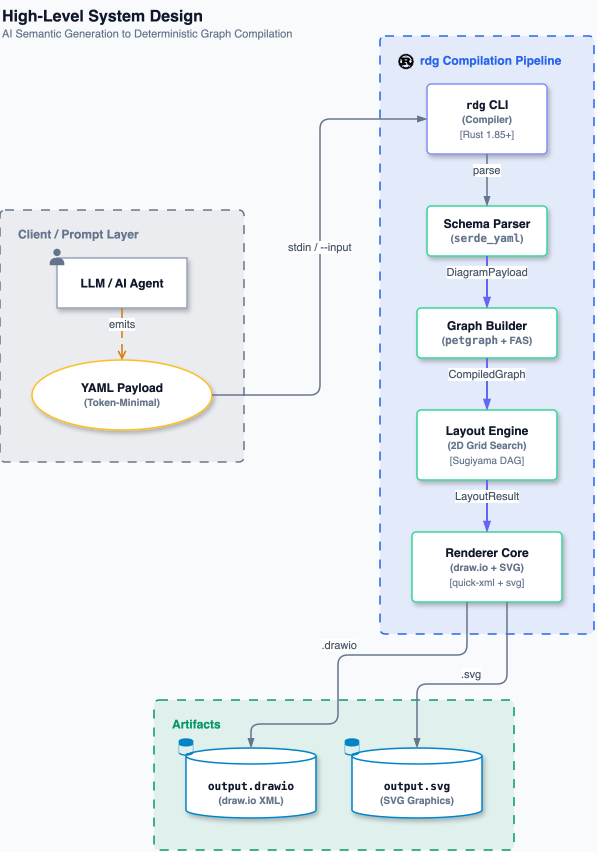
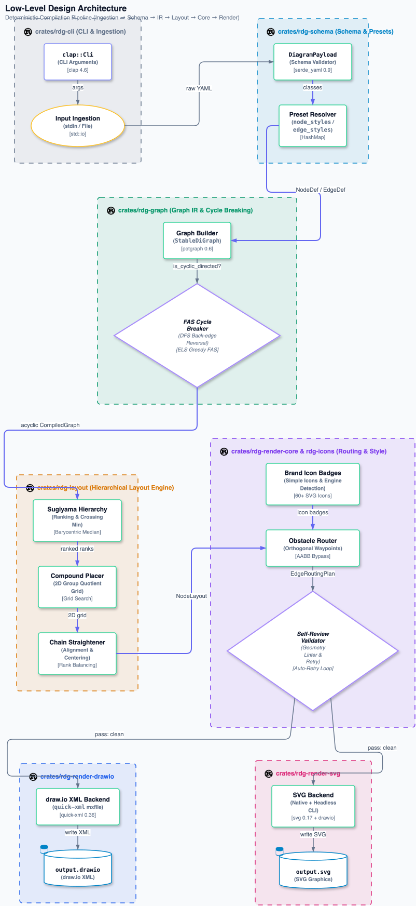

# rdg — Render Diagram

> **Deterministic diagram compiler for LLM-generated semantic graphs.**  
> You describe *what* to draw in token-efficient YAML. `rdg` figures out *where* to draw it.

[](https://www.rust-lang.org)
[](LICENSE)

---

## Why rdg?

Large Language Models are excellent at semantic reasoning but fail at 2D spatial layout. When forced to write raw draw.io XML or SVG, they produce:

- Overlapping nodes and crossing edges  
- Hallucinated pixel coordinates  
- Invalid XML that silently breaks draw.io  
- Massive token waste on geometry boilerplate  

**rdg decouples the two concerns:**

| You (the LLM) | rdg |
|---|---|
| Decide which nodes exist | Compute pixel-perfect x/y coordinates |
| Decide how they connect | Apply Sugiyama hierarchical layout |
| Choose semantic types | Map types to draw.io styles |
| Emit compact YAML | Serialise strict mxfile XML or SVG |

### What's new

- **Topology-dispatched layout**: `rdg` inspects each input graph (cyclicity, edge
  density, compound/nested group structure, connected components) and automatically
  picks between three layout frameworks — the original Sugiyama layered layout, a
  Barnes-Hut force-directed engine, and an fCoSE-style compound spring embedder — plus
  either a fixed corridor router or a visibility-graph A* router for edges, based on
  how obstacle-dense the diagram is. `--layout auto` (the default) reports its choice
  on stderr; `--layout sugiyama|force|fcose` forces one explicitly. See
  [`crates/rdg-dispatch`](crates/rdg-dispatch) for the decision logic.
- **Self-review**: every render runs a deterministic geometry check (overlaps, edges
  cutting through nodes, an explicit size too small for its content, a lopsided canvas)
  and retries with wider spacing before writing anything; `--strict` turns unresolved
  anomalies into a non-zero exit code for CI/agent pipelines.
- **Consistent whitespace**: rank gaps, node gaps, group padding and the canvas margin
  scale with how connected a component is (arrows never shrink below a readable stub,
  parallel edges get their own lanes, a hub's faces are sized to hold its ports), and the
  configured margin holds on all four sides of everything drawn.
- **Polish pass**: the last stage reviews the routed diagram for small imperfections — an
  arrow with a needless micro-jog, an avoidable crossing, two edges drawn on top of each
  other — and fixes each with a small guarded adjustment (sliding a port along its face,
  swapping two edges' ports, moving one edge to another face). A fix is kept only if it
  breaks no rule (no node hit, no extra bend, no shorter arrow) and strictly improves the
  diagram, so the pass is deterministic and idempotent; nodes are never moved. It also
  snaps geometry to whole pixels so draw.io draws exactly what was routed. `--no-polish`
  turns it off; `RDG_DEBUG_POLISH=1` prints every adjustment.
- **Real brand logos**: ~60 languages/clouds/databases/frameworks now use vendored
  [Simple Icons](https://simpleicons.org) artwork (CC0) instead of hand-drawn
  approximations — see [`crates/rdg-icons/assets/THIRD_PARTY_LICENSES.md`](crates/rdg-icons/assets/THIRD_PARTY_LICENSES.md).
- **Flow numbering**: `numbered: true` puts a sequence badge (①②③…) on each edge in
  declaration order, so a reader can trace the flow.
- **Reusable style presets**: define a named `node_styles`/`edge_styles` preset once,
  reference it from any node/edge via `class:` instead of repeating the same overrides.
- **Chain straightening**: a lightweight coordinate-alignment pass keeps simple chains
  vertically/horizontally aligned instead of zigzagging, and centers a node over its
  children's span.
- **More granular control**: per-node `color`/`width`/`height`/`provider`/`link`
  overrides, a draw.io-only `style_extra` raw-style escape hatch, and `canvas`/`spacing`
  config objects for margin and gap tuning.

---

## Architecture

### High-Level Design



> Source: [`docs/hld.yaml`](docs/hld.yaml) — generated with `rdg --input docs/hld.yaml --output docs/hld.svg`

**Pipeline:**

```
LLM / Agent
    │  emits token-efficient YAML
    ▼
rdg CLI (--input / stdin)
    │
    ├─► Schema Parser    (serde_yaml → DiagramPayload)
    ├─► Graph Builder    (petgraph StableDiGraph + FAS cycle breaking)
    ├─► Layout Engine    (deterministic layered layout: topological ranking,
    │                     barycentric crossing minimisation, compound group grid)
    └─► Renderer (shared style/routing core + two backends)
            ├─► draw.io XML  (.drawio)
            └─► SVG          (.svg)
```

### Low-Level Design



> Source: [`docs/lld.yaml`](docs/lld.yaml) — generated with `rdg --input docs/lld.yaml --output docs/lld.svg`

**Crate breakdown** (`rdg` is a Cargo workspace, `crates/*`):

| Crate | Responsibility |
|---|---|
| `rdg-schema` | `serde` structs for YAML input: `DiagramPayload`, `NodeDef`, `EdgeDef` |
| `rdg-graph` | Build `StableDiGraph<NodeData, EdgeData>`; Eades–Lin–Smyth greedy Feedback Arc Set cycle-breaker |
| `rdg-layout` | Deterministic layered layout: topological ranking, barycentric crossing minimisation, compound 2D group grid placement |
| `rdg-icons` | Built-in flat vector icons for languages/databases; language & DB engine detection heuristics |
| `rdg-render-core` | Style/typography/routing shared by both render backends, so they can't drift apart on what a node type or edge style means |
| `rdg-render-drawio` | draw.io (`mxfile`) XML backend |
| `rdg-render-svg` | SVG backend |
| `rdg-cli` | The `rdg` binary: CLI parsing, I/O, ties the pipeline together |

---

## Installation

### Prerequisites

- [Rust](https://rustup.rs) 1.85 or later
- Cargo (bundled with Rust)

### Build from source

```bash
git clone https://github.com/rg12301/rdg.git
cd rdg
cargo build --release
```

The binary is at `target/release/rdg`. Copy it anywhere on your `$PATH`:

```bash
# macOS / Linux
sudo cp target/release/rdg /usr/local/bin/rdg

# Or without sudo, into your home bin:
cp target/release/rdg ~/.local/bin/rdg
```

### Download precompiled binary

**Recommended:** grab a precompiled binary for your platform from the [latest release](https://github.com/rg12301/rdg/releases):

- **macOS**: `rdg-macos-x86_64` (Intel) or `rdg-macos-aarch64` (Apple Silicon)
- **Linux**: `rdg-linux-x86_64` (glibc, x86_64) or `rdg-linux-aarch64` (ARM64)
- **Windows**: `rdg-windows-x86_64.exe`

Unzip/untar and place the binary on your `$PATH`:

```bash
# macOS / Linux example:
tar xzf rdg-macos-aarch64.tar.gz
sudo mv rdg /usr/local/bin/

# Or without sudo:
mv rdg ~/.local/bin/
```

### Verify installation

```bash
rdg --version
# rdg 1.0

rdg --help
# Prints the full LLM-friendly usage guide
```

---

## Usage

### Input schema (YAML)

```yaml
diagram_type: flowchart        # required — logical category
theme: standard                # optional — standard (white-card) or dark
groups:                        # optional — visual swimlane containers
  - id: g1
    label: "Ingestion Tier"
    color: "#0284c7"           # optional hex accent
    nodes: [n1, n2]
nodes:
  - id: n1                     # required — unique, short, no spaces
    label: "API Gateway\nv2.4" # required — supports 2-line title + subtitle
    type: proxy                # optional — controls shape + border accent
    metadata: "Routes traffic" # optional — tooltip annotation
  - id: n2
    label: "Database"
    type: database
edges:
  - from: n1                   # source node id
    to: n2                     # target node id
    label: "SQL queries"       # optional edge label
    edge_style: async          # optional: flow | async | error | data | bidirectional
```

### Node types (White-Card Design System)

All nodes render as clean, modern white cards with subtle elevation (`shadow=1`), 8px rounded corners, and a semantic colored accent:

| `type` value | Shape | Accent Color |
|---|---|---|
| `proxy` / `gateway` / `api` | Rounded card | Indigo (`#818cf8`) |
| `server` / `service` / `backend` | Rounded card | Emerald (`#34d399`) |
| `database` / `db` / `storage` | 3D Cylinder (`cylinder3`) | Sky (`#38bdf8`) |
| `queue` / `broker` / `bus` | Queue (`start_2`) | Amber (`#fbbf24`) |
| `cache` / `redis` | Diamond | Rose (`#f87171`) |
| `function` / `lambda` / `faas` | AWS Lambda icon | Orange (`#fb923c`) |
| `decision` / `condition` | Diamond | Purple (`#a78bfa`) |
| `client` / `user` / `browser` | Person icon | Slate (`#94a3b8`) |
| *(anything else)* | Rounded card | Slate (`#cbd5e1`) |

### Edge styles (`edge_style`)

| Style | Line appearance | Arrow head | Use case |
|---|---|---|---|
| `flow` (default) | Solid slate (`#64748b`) | Filled `blockThin` | Standard synchronous request/response |
| `async` | Dashed amber (`#d97706`, `8 4`) | Open arrow | Asynchronous message / event publication |
| `error` / `fallback` | Dashed red (`#ef4444`, `6 3`) | Hollow `blockThin` | Circuit breaker / dead-letter / fallback |
| `data` / `stream` | 2px Indigo (`#6366f1`) | Filled `blockThin` | High-throughput data stream / replication |
| `bidirectional` | Solid slate (`#64748b`) | Dual `blockThin` | Full-duplex WebSocket / mutual sync |

### CLI flags

```
rdg [OPTIONS]

Options:
  -i, --input <FILE>            YAML input file (omit or use - for stdin)
  -o, --output <FILE>           Output path; extension selects format [default: output.drawio]
  -l, --layout <LAYOUT>         auto | sugiyama | force | fcose [default: auto]
  -t, --theme <THEME>           standard | aws | azure [default: standard]
      --rank-spacing <N>        Vertical gap between layers in px [default: 60]
      --node-spacing <N>        Horizontal gap between nodes in px [default: 40]
      --strict                  Exit non-zero if self-review anomalies remain after retrying
      --no-polish               Skip the final micro-jog / crossing cleanup pass
      --svg-engine <ENGINE>     auto | drawio | native — SVG export engine [default: auto]
  -h, --help                    Print full LLM usage guide
  -V, --version                 Print version
```

### Examples

```bash
# Minimal — read from stdin, write draw.io
rdg --output architecture.drawio << 'EOF'
diagram_type: flowchart
nodes:
  - id: n1
    label: "Client"
    type: client
  - id: n2
    label: "API"
    type: proxy
  - id: n3
    label: "DB"
    type: database
edges:
  - from: n1
    to: n2
    label: "HTTPS"
  - from: n2
    to: n3
    label: "SQL"
EOF

# From file → SVG with custom spacing
rdg --input diagram.yaml --output diagram.svg --rank-spacing 80 --node-spacing 50

# Pipe from LLM output → draw.io → open in browser
cat llm_output.yaml | rdg -o diagram.drawio && open diagram.drawio
```

### Output formats

| Extension | Format | Open with |
|---|---|---|
| `.drawio` | Uncompressed mxfile XML | [draw.io desktop](https://github.com/jgraph/drawio-desktop), [diagrams.net](https://app.diagrams.net) |
| `.svg` | Scalable Vector Graphics | Any browser, embed in Markdown / HTML |

---

## For LLM Agents

Run `rdg --help` from your tool-use environment. The full help text contains:

- Complete YAML schema with rules and examples  
- All node type aliases with visual descriptions  
- An explicit 4-step agentic workflow  
- `DO NOT` guardrails (no coordinate hallucination, no raw XML)  
- Pipe-friendly usage for agentic pipelines  

**Recommended system prompt addition:**

```
You have access to the `rdg` CLI tool. When asked to generate architecture or
flow diagrams, emit ONLY a YAML block following the rdg schema, then call:
  rdg --input <file> --output <file>.drawio
Never compute pixel coordinates. Never write draw.io XML or SVG directly.
Run `rdg --help` to read the full schema and node type reference.
```

---

## Generating the design diagrams

The HLD and LLD for this project were generated using `rdg` itself:

```bash
# High-Level Design
rdg --input docs/hld.yaml --output docs/hld.drawio
rdg --input docs/hld.yaml --output docs/hld.svg

# Low-Level Design
rdg --input docs/lld.yaml --output docs/lld.drawio --rank-spacing 90 --node-spacing 60
rdg --input docs/lld.yaml --output docs/lld.svg    --rank-spacing 90 --node-spacing 60
```

---

## Project structure

```
rdg/
├── Cargo.toml
├── README.md
├── docs/
│   ├── hld.yaml        # HLD input (edit to update diagram)
│   ├── hld.drawio      # Generated HLD — draw.io format
│   ├── hld.svg         # Generated HLD — SVG
│   ├── lld.yaml        # LLD input
│   ├── lld.drawio      # Generated LLD — draw.io format
│   └── lld.svg         # Generated LLD — SVG
└── src/
    ├── main.rs         # CLI entry point (clap)
    ├── lib.rs          # Module root
    ├── schema.rs       # YAML input structs (serde)
    ├── graph.rs        # Graph construction + FAS cycle breaking (petgraph)
    ├── layout.rs       # Spatial layout (layout-rs / topo-sort fallback)
    └── render.rs       # draw.io XML + SVG serialisation (quick-xml)
```

---

## Running tests

```bash
cargo test
# 19 tests — schema, graph, layout, render
```

---

## Dependencies

| Crate | Version | Purpose |
|---|---|---|
| `clap` | 4.6 | CLI argument parsing with derive macros |
| `serde` + `serde_yaml` | 1 / 0.9 | YAML deserialization into typed structs |
| `petgraph` | 0.6 | `StableDiGraph` — stable node indices for layout |
| `layout-rs` | 0.1 | Sugiyama hierarchical layout engine |
| `quick-xml` | 0.36 | Low-overhead XML writer for mxfile + SVG |
| `anyhow` | 1 | Application error handling |
| `thiserror` | 2 | Typed library error definitions |

---

## License

MIT © rdg contributors
